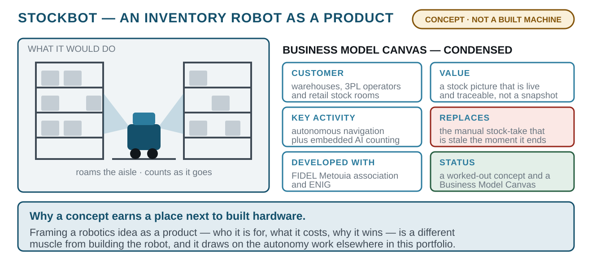

# STOCKBOT — Autonomous Inventory Robot (concept)
> A concept and business model for a warehouse robot that takes stock autonomously — the idea worked out before the hardware.
`2026` · `Concept` · `Business Model Canvas` · `Warehouse robotics` · `Embedded AI` · `Pitch`



## About

STOCKBOT is a concept for an autonomous inventory robot: a mobile platform that roams a warehouse and counts stock on its own, using embedded AI to keep a real-time, traceable picture of what is on the shelves — replacing the manual stock-take that ties up staff and is out of date the moment it finishes.

This one is presented honestly as what it is: a worked-out concept and a **Business Model Canvas**, developed with the FIDEL Metouia association and ENIG, not a built machine. It is here because framing a robotics idea as a product — who it is for, what it costs, why it wins — is a different and useful muscle from building the robot, and it draws directly on the autonomy and perception work elsewhere in this portfolio.

## Contents

```
docs/
```

## Notes

CONCEPT - a design and business-model study, not built hardware.

## Author

Lassaad Mahmoudi — <assaadmahmoudi0@gmail.com>  
https://linkedin.com/in/mahmoudiassaad
